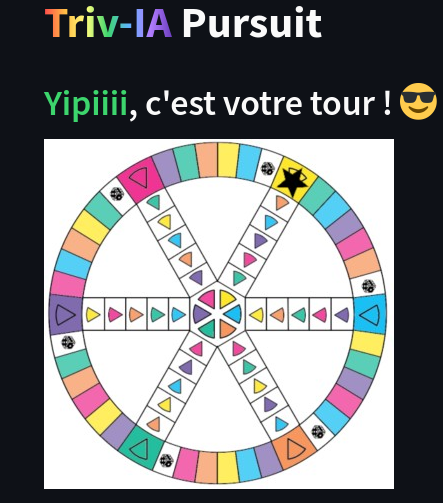

# <p align="center">Brief_Triv-IA_Pursuit</p>
<p align="center">
    
</p>

Inspired by the famous game Trivial Pursuit, Triv-IA Pursuit is an interactive question game designed to test and reinforce skills acquired during training. Players advance in the game by rolling dice and answering questions from several thematic categories.

## ➤ Menu

* [➤ Installation](#installation-)
* [➤ Play !](#play-)

## Installation :

#### Create the virtual environment

```bash
cd /path/to/BRIEF_TRIV-IA_PURSUIT

python -m venv .venv

source venv/bin/activate
```


#### Install requirements :

```bash
pip install -r requirements.txt
```

#### Init data base :


```bash
python database_tester.py
```


#### Run sreamlit :

```bash
streamlit run main.py
```


### Play !